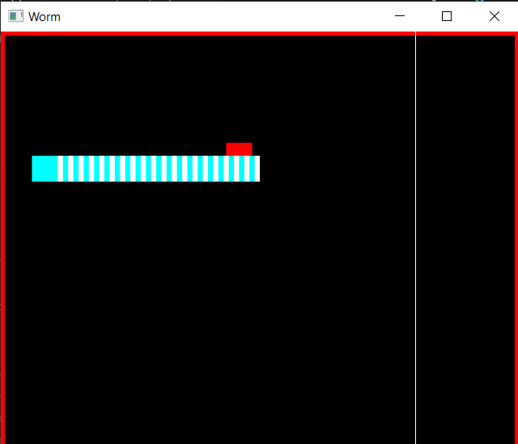

# Worm-Game
A simple C++ project

# Deps - Third Party
This project depends of [SFML](https://www.sfml-dev.org/index.php)

# Building and Compiling

If you use **MinGW** to compiler your C++ code, you may install SFML in the project folder and use
this command in your terminal: 

```
g++ main.cpp -I"include" -L"lib" -lsfml-graphics -lsfml-audio -lsfml-window -lsfml-system -o Worm_Game.exe
```



# Contact-me
You're free to give me suggestions
